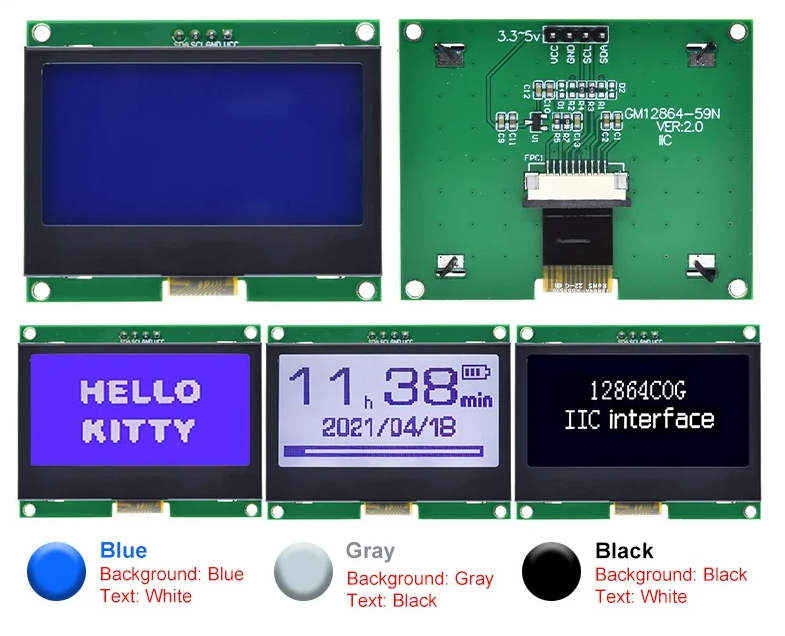

# ST7567 I2C/IIC display (ST7567S, GM12864-59N) component for ESPHome
https://github.com/latonita/esphome-st7567s-display/

*This is temporary solution as of 2023/12 until this driver included into Esphome base components (https://github.com/esphome/esphome/pull/5952).*
**Component already merged into `dev` branch of EspHome, next step - it will be released to wide audience with new EspHome release.**


This is ESPHome component to support I2C display from Aliexpress/Ebay.
Sellers often sell it as: 12864 IIC 4P LCD Module 128X64 I2C ST7567S COG Graphic Display Screen Board LCM Panel 128x64 Dot Matrix Screen for Arduino



Component idea taken from SPI implementation by @nicolaij (https://github.com/nicolaij/esphomes/tree/main/custom_components/st7567).

Add to your YAML config: 

```
external_components:
  source: github://latonita/esphome-st7567s-display@main
  components: [st7567s]

...

i2c:
  sda: <SDA PIN #>
  scl: <SCK PIN #>
  scan: true

font:
 - file: "gfonts://Roboto"
   id: font_roboto
   size: 24

display:
 - platform: st7567s
   address: 0x3F
   lambda: |-
     it.print(0, 0, id(font_roboto), "Hello World!");

```

Example configuration for NodeMCU (esp8266) [`st7567s-display-test.yaml`](st7567s-display-test.yaml).

